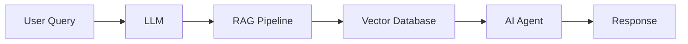

# 👋 Hi, I'm Ramani

<div align="center">

# 🤖 AI Software Engineer

### Building Intelligent AI Systems • Generative AI • AI Agents • Cybersecurity


</div>

---

## 🚀 About Me

- 🎓 Integrated M.Tech CSE Student
- 🤖 Passionate about Artificial Intelligence & Generative AI
- 🔒 Cybersecurity Enthusiast
- ☁️ Exploring Cloud Computing & MLOps
- 🚀 Building AI Agents, RAG Applications & Automation Systems
- 📚 Learning Advanced LLM Engineering
- 💡 Interested in AI Security & Responsible AI

---

## 🛠️ Tech Stack

### Languages

<p>

</p>

### AI & Machine Learning

<p>

</p>

- LangChain
- Hugging Face
- Google Gemini
- OpenAI APIs
- RAG Applications
- AI Agents

### Cloud & DevOps

<p>

</p>

### Databases

<p>

</p>

---

## 🤖 AI Engineering Skills

```text
✓ Prompt Engineering
✓ Retrieval Augmented Generation (RAG)
✓ AI Agent Development
✓ LLM Applications
✓ Generative AI
✓ API Development
✓ Machine Learning
✓ Deep Learning
✓ AI Security
✓ Cloud Deployment
✓ Automation Workflows
✓ MLOps Fundamentals
```

---

## 🚀 Featured Projects

### 🌾 AI Farming Advisor

AI-powered agricultural assistant that provides:

- Crop recommendations
- Weather analysis
- Soil insights
- Market intelligence

---

### 🤖 AI Startup Studio

Platform for entrepreneurs to:

- Generate startup ideas
- Build MVPs
- Deploy applications
- Automate workflows

---

### 🔐 VulnAudit

AI-powered vulnerability assessment platform:

- Security scanning
- Risk assessment
- AI-generated reports

---

## 📈 AI System Workflow



---

## 📊 GitHub Statistics

<div align="center">


</div>

---

## 📈 Contribution Graph


---

## 🏆 Certifications & Training

- Cybersecurity Internship
- Practical Blue Team Internship
- Full Stack Development Training
- Generative AI Learning Programs
- Cloud Computing Fundamentals

---

## 📚 Currently Learning

- Agentic AI Systems
- Advanced RAG Architectures
- AI Security
- Reinforcement Learning
- LLM Fine-Tuning
- Multi-Agent Systems
- MLOps

---

## 🎯 2026 Goals

- Build Production-Ready AI Applications
- Contribute to Open Source AI Projects
- Publish AI Research Work
- Master AI Security
- Develop Advanced AI Agents

---

## 🌐 Connect With Me

<p align="center">
<a href="https://github.com/YOUR_USERNAME">

</a>

<a href="https://linkedin.com/in/YOUR_LINK">

</a>
</p>

---

## 💭 Favorite Quote

> "Artificial Intelligence is not about replacing humans; it's about amplifying human potential."

---

<div align="center">

### ⭐ Thanks for visiting my profile!


</div>
